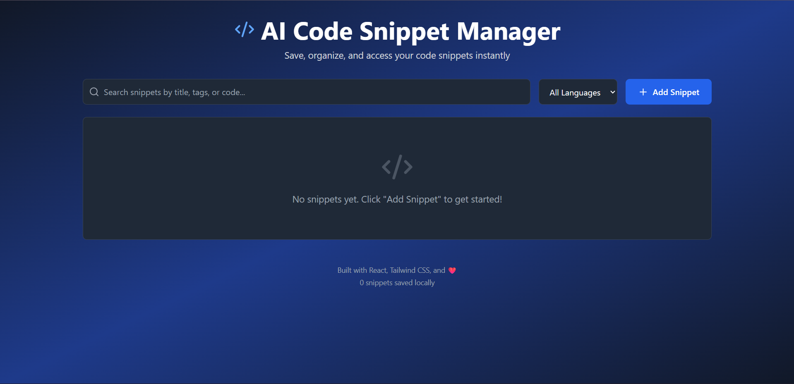
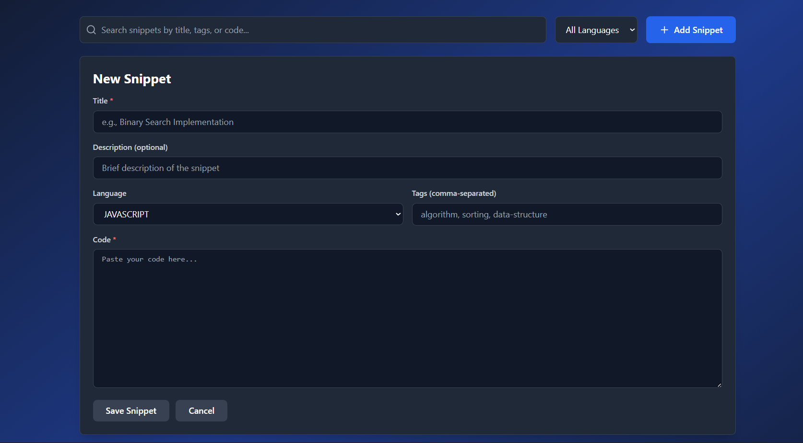

# 🚀 AI Code Snippet Manager

A modern, responsive web application for managing code snippets with syntax highlighting, search, and organization features. Built specifically to demonstrate understanding of AI-powered coding platforms and React development skills.

[🌐 **Live Demo**](https://ai-code-snippet-manager-pi.vercel.app/)

A modern, responsive web application for managing code snippets...


## ✨ Features

### Core Functionality
- ✅ **Add/Edit/Delete** code snippets with ease
- ✅ **Syntax highlighting** for 10+ programming languages
- ✅ **Real-time search** across titles, tags, descriptions, and code
- ✅ **Filter by language** to quickly find what you need
- ✅ **One-click copy** to clipboard functionality
- ✅ **Local storage** for persistent data across sessions
- ✅ **Fully responsive** design that works on all devices

### User Experience
- 🎨 Modern dark theme UI with gradient backgrounds
- 🔍 Instant search with live filtering
- 📱 Mobile-friendly interface
- ⚡ Fast and lightweight
- 💾 Automatic data persistence
- 🎯 Clean, intuitive interface

## 🛠️ Tech Stack

- **Frontend Framework:** React 18.3
- **Build Tool:** Vite 5.4
- **Styling:** Tailwind CSS 3.4
- **Syntax Highlighting:** react-syntax-highlighter
- **Icons:** Lucide React
- **Storage:** Browser Local Storage API

## 🚀 Getting Started

### Prerequisites
- Node.js 16+ installed on your machine
- npm or yarn package manager

### Installation

1. **Clone the repository**
```bash
git clone https://github.com/yourusername/ai-code-snippet-manager.git
cd ai-code-snippet-manager
```

2. **Install dependencies**
```bash
npm install
```

3. **Run the development server**
```bash
npm run dev
```

4. **Open your browser**
Navigate to [http://localhost:5173](http://localhost:5173)

### Build for Production

```bash
npm run build
```

The optimized production build will be in the `dist` folder.

### Preview Production Build

```bash
npm run preview
```

## 📸 Screenshots

### Main Dashboard


### Add Snippet Form


## 🎯 Use Cases

- **Personal Code Library:** Store your frequently used code snippets
- **Learning Resource:** Keep track of code patterns you're learning
- **Quick Reference:** Quickly access algorithms and data structures
- **Interview Prep:** Organize coding interview solutions
- **Team Sharing:** Export and share snippets with teammates

## 📚 Supported Languages

The app currently supports syntax highlighting for:

- JavaScript
- Python
- Java
- C++
- SQL
- HTML
- CSS
- TypeScript
- Go
- Rust

## 🎨 Design Philosophy

This project demonstrates:
- **Clean Code:** Well-organized, readable React components
- **Modern UI/UX:** Intuitive interface with smooth interactions
- **Performance:** Optimized with Vite for fast builds and hot reload
- **Accessibility:** Semantic HTML and keyboard navigation support
- **Responsive Design:** Works seamlessly across all device sizes

## 🔮 Future Enhancements

Potential features for future development:

- [ ] Cloud synchronization across devices
- [ ] User authentication and accounts
- [ ] Export/Import snippets (JSON, CSV)
- [ ] Code execution in sandboxed environment
- [ ] Collaborative features for team sharing
- [ ] AI-powered code suggestions and improvements
- [ ] Dark/Light theme toggle
- [ ] Snippet categories and folders
- [ ] Version history for snippets
- [ ] Public snippet gallery

## 🏗️ Project Structure

```
ai-code-snippet-manager/
├── src/
│   ├── App.jsx          # Main application component
│   ├── main.jsx         # React entry point
│   └── index.css        # Global styles with Tailwind
├── public/              # Static assets
├── index.html           # HTML entry point
├── package.json         # Dependencies and scripts
├── vite.config.js       # Vite configuration
├── tailwind.config.js   # Tailwind configuration
└── README.md           # This file
```

## 🤝 Contributing

Contributions are welcome! Feel free to:

1. Fork the repository
2. Create a feature branch (`git checkout -b feature/AmazingFeature`)
3. Commit your changes (`git commit -m 'Add some AmazingFeature'`)
4. Push to the branch (`git push origin feature/AmazingFeature`)
5. Open a Pull Request

## 📝 License

This project is licensed under the MIT License - see the [LICENSE](LICENSE) file for details.

## 👨‍💻 Author

**Your Name**
- GitHub: [@GayatriGovindaSetty](https://github.com/yourusername)
- LinkedIn: [Your LinkedIn](https://www.linkedin.com/in/gayatrigovindasetty/)
- Email: gayatrigovindasetty@example.com

## 🙏 Acknowledgments

- Inspired by the need for better code snippet management
- Built with modern web technologies
- Designed for developers, by developers
